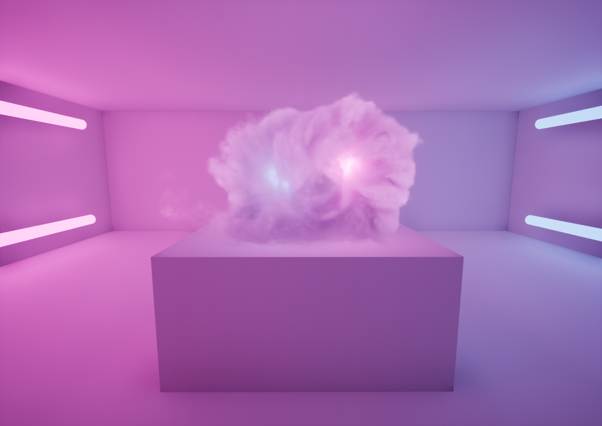

# OpenVDB and NanoVDB in Unreal

## Introduction

This repo is my continued effort to keep the _SparseVolumetrics_ aka _UnrealVDB_ plugin alive and up to date.

Because plugins have very limited access to the renderer, I have now decided to **change Unreal source code** to allow
for better rendering and features like lighting, Lumen sampling, shadows read and write, volumetric fog 
integration etc. 

See those [instructions](#instructions) to be able to use all those wonderful features.

This plugin first started as an Eidos-Montreal R&D project and was shared with the community in January 2022 (huge thanks to Eidos-Montreal for letting me do this). 
From that moment on, I've been working, updating, fixing and improving the plugin on my spare time only 
(and I have also left Eidos-Montreal).

I highly recommend reading these first:

[The initial README documentation.](https://github.com/eidosmontreal/unreal-vdb/blob/main/README.md)

[Some help to make your volumes look nice.](README.md)

## Instructions

For convenience, this repository is compatible by default with vanilla versions of Unreal (you still need to compile it yourself, within a C++ Unreal project).

**But to get all the new features you will need to compile my custom version of Unreal:**

1. Download / Clone [my custom version of Unreal](https://github.com/thilamb/UnrealEngine-Modified) (make sure to fetch the [correct branch](https://github.com/thilamb/UnrealEngine-Modified/tree/5.2)).
2. Download / Clone this repository in the custom Unreal `Engine/Plugins` folder
3. Open `Source/Runtime/VolumeRuntime.Build.cs` and set `VDB_ENGINE_MODIFICATIONS` and `VDB_CAST_SHADOWS` values to 1
4. Compile Unreal

That's it ! 

Please read
[how to access Unreal Engine source code on GitHub](https://www.unrealengine.com/en-US/ue-on-github) 
 and [how to compile Unreal](https://github.com/thilamb/UnrealEngine-Modified/tree/5.2#getting-up-and-running).

## Disclaimer

This repository is **my personal sandbox to experiment, have fun and keep learning Unreal**.

This is NOT meant to be a polished, bug-free and user-friendly plugin that I'll distribute every time Epic releases a new 
version of Unreal. 

I'm willing to help anyone who tries to use it though, if you're asking nicely and politely 😊.

You can contact me on [Twitter](https://twitter.com/LambertTibo) or [Discord](https://discordapp.com/users/thibaultlambert).

## License

Licensed under the Apache License, Version 2.0 (the "License"). See LICENSE for the full license text or you may 
obtain a copy of the License at

> http://www.apache.org/licenses/LICENSE-2.0